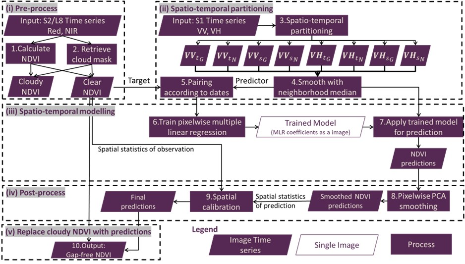

# Reconstructing Optical satellite images (Sentinel-2 or Landsat 8) using Sentinel-1 based modelling on Google Earth Engine (GEE)
Python scripts GEE_Optical_Gaps.py and GEE_Optical_Infilling.py achieve these two objectives respectively and independently. 
All outputs will be exported to the Google Drive linked to the GEE account.
## Description
- fusion_GEE.py performs GEE-based optical-SAR fusing. It retrieves optical and SAR satellite images from GEE for an user-specified period and AOI, predicts cloudy optical images with corresponding SAR images which are not affected by cloud, and outputs infilled optical images.
- Parameters.json in config folder contains the configuration for all environmental and model parameters.
- The AOI.shp in AOI folder contains all case study sites as below:
| Name               | Landcover and Natural                                                         | Area (km^2) | Site Central Longitude (°E) | Site Central Latitude (°S) |
|--------------------|-------------------------------------------------------------------------------|-------------|-----------------------------|----------------------------|
| North NT           | Conservation environments and irrigated perennial horticulture                | 24          | 131.2                       | -12.59                     |
| Central West NSW   | Grazing native vegetation and dryland cropping                                | 16          | 148.77                      | -31.32                     |
| Central Tas        | Grazing modified pasture and irrigated cropping                               | 7           | 147.51                      | -41.92                     |
| South West Qld     | Irrigated cropping                                                            | 10          | 145.73                      | -27.94                     |
| East Gippsland Vic | Production native forests and grazing modified pastures affected by bush fire | 5           | 148.43                      | -37.64                     |
| North Qld          | Sugar cane with surrounding rainforest                                        | 19          | 145.8                       | -17.05                     |
| Wheatbelt WA       | Dryland cropping, wheat, oats and pasture                                     | 19          | 117.26                      | -32.89                     |

## Flow charts
- SAR-OPT_fusion

## Challenges
- GEE_Optical_Gaps.py has been fully (all avaiable images selected) tested for AOIs less than 100 km x 100 km (1e8 pixels),
larger AOIs may need to be divided into smaller tiles.
- Although GEE_Optical_Infilling.py sets the maximum pixels to 1e9, GEE_Optical_Infilling.py has only been fully tested on a small AOI (e.g. 5 km * 3 km, 1.5e5 pixels), 
which took 3 (1) hours to run, and 300 MB (200 MB) to store data for Sentinel-2 (Landsat-8). 
We explored the capability of this model at an entire Landsat-8 WRS2 tile (185 km x 180 km, 3.3e8 pixels). 
it took about 10 hours to train the model for Landsat-8 and consumed more than 20 GB to save the trained model as an intermediate output
(we did not compelete the entire process and exported final outputs due to shortage of storage).
## Installation
To use GEE, you must first *[sign up](https://earthengine.google.com/signup/)* for a *[Google Earth Engine](https://earthengine.google.com/)* account.

The project requires earth-engine-api and few other packages to be installed.
A conda environment with the required dependencies can be created with
```bash
conda create -n GEE_SAR_OPT python = 3.7
conda activate GEE_SAR_OPT
pip install earthengine-api
pip install geopandas
pip install pandas
pip install json
```
To authenticate and initialize ee
```bash
import ee
ee.Authenticate()
ee.Initialize()
```bash
## Usage
The setup and parameters can be tuned in the Parameters.json in config folder.
To implement the gap infilling
```bash
cd scripts
python fusion_GEE.py
```
## Dataset Paths
Output images and metadata will be saved in a Google Drive folder named according to the parameter "PROJECT_TITLE". 
GEE will search for the folder name on Google Drive from root to sub directories.
If the folder has already existed in a subdirectory, outputs will be saved there, 
otherwise, GEE will create a new folder under the root path.
## Credits
This project was funded by CSIRO Digiscape FSP. It involved Yongjing Mao, Tim McVicar and Tom Van Niel.


